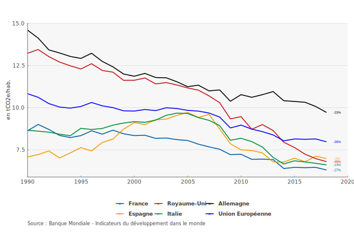
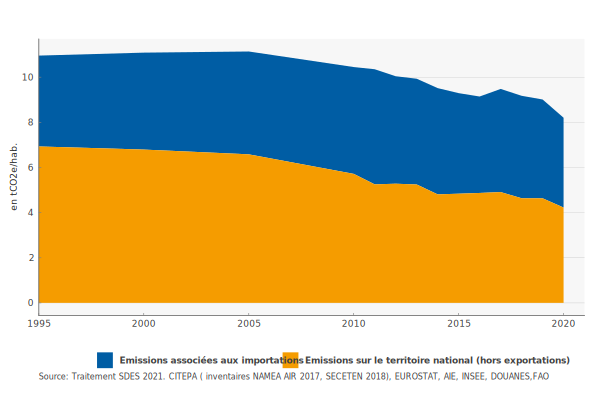
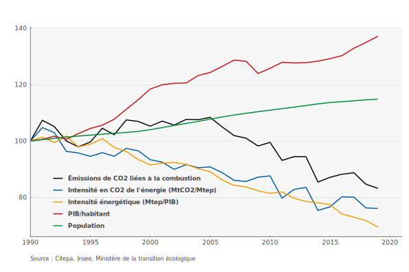
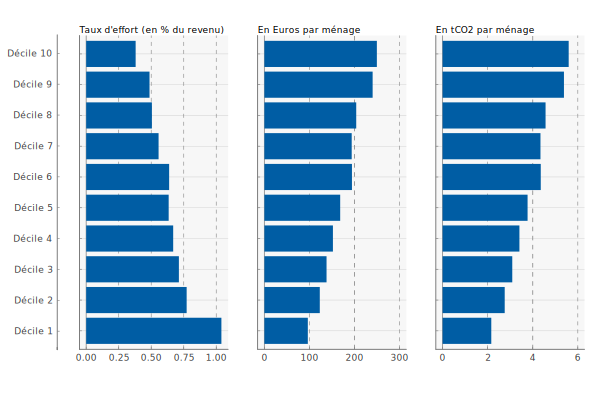
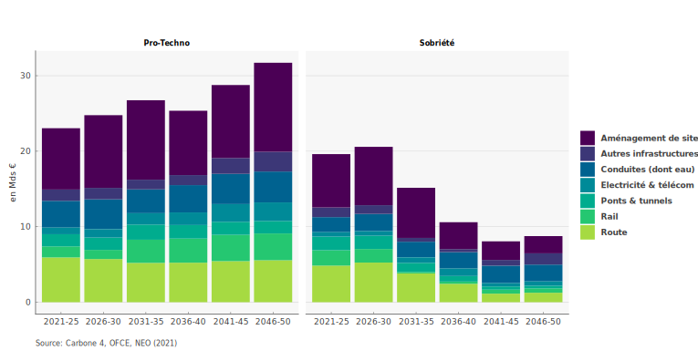
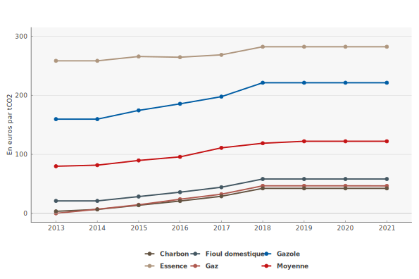

# OFCE Repro année 2022

Reproductibilité des graphiques 2022 sous R

Les codes pour reproduire les graphiques (une partie) publiés sont mis dans ce dépôt. Chaque dossier correspond à une publication pour l'année 2022.

## Policy Brief

### [Policy Brief 100](https://www.ofce.sciences-po.fr/pdf/pbrief/2022/OFCEpbrief100.pdf): Placer l'environnement au coeur de la politique économique (09-02-2022)
 *[Graphique 1](PB_100/plot_1/Plot_1.R): Émissions territoriales de GES (hors LULUCF) (1990-2018)* ;

 *[Graphique 2](PB_100/plot_2/Plot_2.R): Composantes de l’empreinte carbone en France* ;

 *[Graphique 3](PB_100/plot_3/Plot_3.R): Émissions de CO2 liées à la combustion d’énergies fossiles et leurs déterminants selon l’identité de Kaya (1990-2019)* ;

*[Graphique 4](PB_100/plot_4/Plot_4.R): Contribution climat énergie à 44,6€ la tonne de CO2 (niveau 2018) sur le revenu des ménages et le volume des émissions par décile de niveau de vie* ;

*[Graphique 5](PB_100/plot_5/Plot_5.R): Investissements additionnels par scénario et par secteur d’activité* ;

*[Graphique 6](PB_100/plot_6/Plot_6.R): Taxe carbone implicite en France (€/t CO2)* ;

